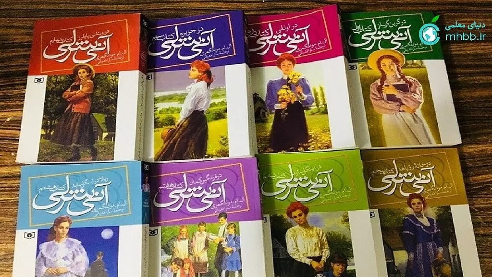

<div dir="rtl" markdown="1">

# راهنمای نوشتن متن فارسی و راست‌به‌چپ در ژوپیتربوک

در این بخش با نحوه نوشتن متن فارسی در Jupyter Book آشنا می‌شوید.

---

## نوشتن متن فارسی

برای نوشتن متن فارسی کافی است متن خود را به صورت معمولی وارد کنید. برای نمایش صحیح راست‌به‌چپ، از تگ `<div dir="rtl" markdown="1">` استفاده کنید:

```markdown
<div dir="rtl" markdown="1">

متن فارسی شما اینجاست.

- مورد اول
- مورد دوم

</div>
```

خروجی:

متن فارسی شما اینجاست.

- مورد اول
- مورد دوم

---

درج کد و فرمول و عکس هم مشابه حالت انگلیسی هست.


<div dir="ltr" markdown="1">

```python
print("Hello, World!")  # این کد چه جوری چپ به راست مانده؟
```

</div>

فرمول لاتک:

```markdown
$$ E=mc^2 $$
```

خروجی:

$$ E=mc^2 $$

---

##  در ستایش نرم‌افزار ابسیدیَن

**ابسیدین (Obsidian)** یک نرم‌افزار یادداشت‌برداری و مدیریت دانش شخصی است که با استفاده از فایل‌های متنی ساده (Markdown) کار می‌کند. این ابزار به کاربران اجازه می‌دهد تا یادداشت‌های خود را به صورت گراف ارتباطی به هم متصل کنند و ساختاری شبکه‌ای از دانش شخصی بسازند.  
ابسیدین برای افرادی که به دنبال سازماندهی ایده‌ها، پروژه‌ها و اطلاعات خود هستند، گزینه‌ای قدرتمند و منعطف محسوب می‌شود.
برای اطلاعات بیشتر به 
[ در ستایش نرم‌افزار Obsidian](https://aprd.ir/about-obsidian/)
مراجعه فرمایید.

##  دکتر جکیل در مجموعه هشت جلدی آن شرلی

مجموعه‌ی 
[آن شرلی](https://fa.wikipedia.org/wiki/%D8%A2%D9%86_%D8%B4%D8%B1%D9%84%DB%8C)
 نوشته‌ی لوسی ماد مونتگومری، شامل هشت جلد است که داستان زندگی آن شرلی، دختر یتیم و خیال‌پرداز اهل کانادا را از کودکی تا بزرگسالی و مادر شدن روایت می‌کند. این مجموعه با جلد اول یعنی "آن شرلی در گرین گیبلز" آغاز می‌شود و با جلد هشتم یعنی "ریلا از اینگل‌ساید"  به پایان می‌رسد. هر جلد به بخشی از زندگی آن و خانواده و دوستانش می‌پردازد و تصویری زیبا و الهام‌بخش از رشد، امید، عشق و چالش‌های زندگی ارائه می‌دهد.

**جلدهای این مجموعه عبارتند از:**

1. آن در گرین گیبلز (۱۹۰۸)
2. آن در اونلی (۱۹۰۹)
3. آن در جزیره (۱۹۱۵)
4. آن در خانه رؤیاها (۱۹۱۷)
5. دره رنگین‌کمان (۱۹۱۹)
6. ریلا در اینگل‌ساید (۱۹۲۱)
7. آن در ویندی پاپلز (۱۹۳۶)
8. آن در اینگل‌ساید (۱۹۳۹)



در جلد هشتم، "ریلا از اینگل‌ساید"، گربه‌ای به نام "دکتر جکیل و آقای هاید" حضور دارد که شخصیت دوگانه و رفتارهای عجیبش باعث شده این نام برایش انتخاب شود. این اشاره جالب به رمان معروف "[دکتر جکیل و آقای هاید](https://en.wikipedia.org/wiki/Strange_Case_of_Dr_Jekyll_and_Mr_Hyde)" است.

احتمالا نام سایت‌ساز استاتیک جکیل از این شخصیت گرفته شده است؛ چرا که Jekyll نیز ابزاری است که به نوعی دو چهره دارد: یک چهره ساده و یک چهره قدرتمند و پیشرفته برای ساخت سایت‌ها.

</div>