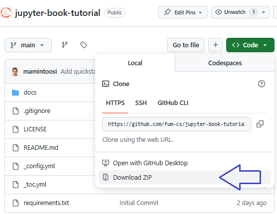

در این فایل راهنمای کار با
JupyterBook
آمده است.
من مایلم آنرا به سه فایل مجزا تقسیم کنم.
۱- فایل اول :
راهنمای سریع برای اجرای محلی هست: که شامل

نصب آناکوندا و کتابخانه های اصلی
دانلود همین مخزن
و اجرای
jupyter-book build ./
فایل دوم :
روش انتقال صفحات ایجاد شده به گیت هاب هست که شامل

نصب گیت
نصب گیت هاب دسکتاپ
ایجاد یک مخزن
کلون کردن مخزن
کپی فایلهای مرحله قبل به مخزن
کامیت کردن تغییرات
و اجرای دستور زیر برای انتقال به اینترنت است
ghp-import -n -p -f ./_build/html
فایل سوم شامل مراحل پیشرفته تر
مانند کار با فارسی
که یک نمونه در فایل
docs/persian-text.md
آمده است و ...

فعلا
دو مرحله اول را ایجاد کن و برای فایلهای مارک داون نام مناسبی درنظر بگیر

دو فایل اول و دوم به زبان انگلیسی باشند.
فایل سوم به زبان فارسی باشد

# Quickstart Guide for Local Execution

This guide will help you quickly set up and run Jupyter Book locally on Windows.

## Step 1: Install Anaconda

1. Download and install [Anaconda](https://www.anaconda.com/).
2. During installation, ensure you check the option to **add Anaconda to the system PATH**.
3. Verify the installation by running the following command in the Command Prompt:
   ```sh
   conda --version

Step 2: Download the Repository
Go to the following URL in your browser:
https://github.com/fum-cs/jupyter-book-tutorial

Click on the Code button and then select Download ZIP.
Below is an example image of the page:



Extract the downloaded ZIP file to a folder on your computer.

Step 3: Install Jupyter Book
Open the Command Prompt and run the following command to install Jupyter Book:

pip install -U jupyter-book

Step 4: Build the Book


Navigate to the folder where you extracted the repository:
cd path\to\jupyter-book-tutorial

Build the book using the following command:
jupyter-book build ./

The generated HTML files will be available in the _build/html/ directory.
Open these files in your browser to view the book locally.
